<picture>
  <source media="(max-width: 600px)" srcset="assets/terminal-mobile.svg" />
  
</picture>

**Raju Bandam** · AI/ML · Android · Computer Vision · Full-stack

I build apps that run AI on the device, and software that makes camera input useful. I'm interested in what a phone can do with local models, limited memory, and no internet connection.

[Portfolio](https://rajureddie.site/) · [LinkedIn](https://linkedin.com/in/rajureddie) · [Email](mailto:rajubandam694@gmail.com) · [Profile source](profile.toml)

## ~/projects

### [LocalMind](https://github.com/rajureddi/LocalMind)

**Language and vision models, running on Android.**

Chat, image understanding, PDF Q&A, and local model management built around MNN. Model downloads need a connection; inference runs on the phone.

`Kotlin` · `Jetpack Compose` · `MNN`

[Source & demo](https://github.com/rajureddi/LocalMind) · [Releases](https://github.com/rajureddi/LocalMind/releases)

### [Vision navigation](https://github.com/rajureddi/On-Device-MultiModel-Ai-for-blind-navigation-and-low-vision-enhancement)

**Camera input → scene understanding → short voice guidance.**

An on-device accessibility project for blind and low-vision users, connecting multimodal models, OCR, and speech output.

`CameraX` · `MNN` · `VLMs` · `OpenCV` · `TTS`

### [Traffic control](https://github.com/rajureddi/Smart-AI-Based-Traffic-Management-System)

**Vehicle detection → traffic density → adaptive signals.**

YOLO-based traffic management with emergency-vehicle prioritization and signal timing informed by what the camera sees.

`YOLO` · `Computer vision` · `Adaptive control`

### [TurantPay](https://github.com/rajureddi/TurantPay)

**Payments without mobile internet.**

An Android interface for `*99#` USSD/UPI workflows. It uses the cellular channel, so network coverage is still required.

[Android source](https://github.com/rajureddi/TurantPay) · [Web companion](https://github.com/rajureddi/turantpay_web)

## ~/notes

- **Local inference:** fitting language and vision models into mobile memory and latency budgets.
- **Accessible interactions:** connecting camera input, model output, and concise voice guidance.
- **Edge computing:** exploring how devices can share work and keep useful features available offline.

<strong>stack.txt</strong> — languages, runtimes, and tools

**Languages:** Python, Kotlin, Java, C++, JavaScript  
**AI & vision:** PyTorch, TensorFlow, OpenCV, YOLO, MNN, MediaPipe, LLMs, VLMs  
**Android:** Jetpack Compose, CameraX, NDK, JNI  
**Full-stack:** React, FastAPI, Flask, Node.js, PostgreSQL, MongoDB  
**Infrastructure:** Docker, AWS

---

B.Tech CSE (AI & ML) · Malla Reddy University · 2022–2026 · India

[Repositories](https://github.com/rajureddi?tab=repositories) · [Contribution history](https://github.com/rajureddi) · [Contact](mailto:rajubandam694@gmail.com)
