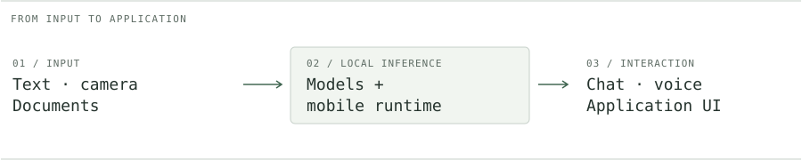

# Raju Bandam

**AI/ML · Android · Computer Vision · Full-stack**

I build Android apps that run AI locally, and software that turns camera input into something useful. My projects span local language models, accessibility, traffic systems, and payments without mobile internet.

[Portfolio](https://rajureddie.site/) &nbsp; / &nbsp; [LinkedIn](https://linkedin.com/in/rajureddie) &nbsp; / &nbsp; [Email](mailto:rajubandam694@gmail.com) &nbsp; / &nbsp; [GitHub](https://github.com/rajureddi)

<picture>
  <source media="(max-width: 600px) and (prefers-color-scheme: dark)" srcset="assets/workflow-mobile-dark.svg" />
  <source media="(max-width: 600px)" srcset="assets/workflow-mobile-light.svg" />
  <source media="(prefers-color-scheme: dark)" srcset="assets/workflow-dark.svg" />
  
</picture>

## Selected work

<table>
<tr>
<td colspan="2" valign="top">
01 &nbsp; / &nbsp; ON-DEVICE AI
<h3><a href="https://github.com/rajureddi/LocalMind">LocalMind</a></h3>

An AI assistant that runs on your Android phone. Chat with local models, ask questions about images and PDFs, and manage model downloads in one app.

<strong>Download the model once. Run inference offline.</strong>

<code>Kotlin</code> <code>Jetpack Compose</code> <code>MNN</code>

<a href="https://github.com/rajureddi/LocalMind">Source &amp; demo ↗</a> &nbsp; · &nbsp; <a href="https://github.com/rajureddi/LocalMind/releases">Releases ↗</a>

</td>
</tr>
<tr>
<td width="50%" valign="top">
02 &nbsp; / &nbsp; ACCESSIBILITY
<h3><a href="https://github.com/rajureddi/On-Device-MultiModel-Ai-for-blind-navigation-and-low-vision-enhancement">Vision navigation</a></h3>

Camera-based scene understanding and concise voice guidance for blind and low-vision users.

<strong>Camera → context → speech</strong>

<code>CameraX</code> <code>VLMs</code> <code>OCR</code> <code>TTS</code>

<a href="https://github.com/rajureddi/On-Device-MultiModel-Ai-for-blind-navigation-and-low-vision-enhancement">Explore project ↗</a>

</td>
<td width="50%" valign="top">
03 &nbsp; / &nbsp; COMPUTER VISION
<h3><a href="https://github.com/rajureddi/Smart-AI-Based-Traffic-Management-System">Traffic control</a></h3>

Vehicle-density analysis, emergency-vehicle priority, and adaptive traffic-signal timing.

<strong>Detection → density → timing</strong>

<code>YOLO</code> <code>OpenCV</code> <code>Python</code>

<a href="https://github.com/rajureddi/Smart-AI-Based-Traffic-Management-System">Explore project ↗</a>

</td>
</tr>
<tr>
<td colspan="2" valign="top">
04 &nbsp; / &nbsp; CONNECTIVITY-CONSTRAINED SOFTWARE
<h3><a href="https://github.com/rajureddi/TurantPay">TurantPay</a></h3>

An Android interface for <code>*99#</code> USSD/UPI payments without mobile internet. Cellular service is still required.

<a href="https://github.com/rajureddi/TurantPay">Android source ↗</a> &nbsp; · &nbsp; <a href="https://github.com/rajureddi/turantpay_web">Web companion ↗</a>

</td>
</tr>
</table>

## What I work with

**Models & perception**  
PyTorch, TensorFlow, OpenCV, YOLO, MNN, MediaPipe, LLMs, VLMs

**Mobile & native code**  
Kotlin, Java, C++, Jetpack Compose, CameraX, Android NDK, JNI

**Applications & infrastructure**  
Python, JavaScript, React, FastAPI, Flask, Node.js, PostgreSQL, MongoDB, Docker, AWS

## On my workbench

I'm exploring how much useful intelligence can fit on a phone: model memory requirements, inference latency, and the camera-to-voice interaction. I'm also interested in how devices can share work at the edge.

The questions that keep me building: **Does it fit the device? Does it work offline? Can someone use it?**

---

B.Tech CSE (AI & ML) · Malla Reddy University · 2022–2026 · India

[More repositories](https://github.com/rajureddi?tab=repositories) · [Contribution activity](https://github.com/rajureddi) · [Get in touch](mailto:rajubandam694@gmail.com)
