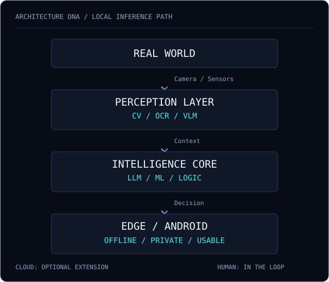

```text
> INITIALIZING RAJU.OS...
> Neural Runtime ........ ONLINE
> Android Runtime ....... ONLINE
> Vision Engine ......... ONLINE
> Edge Intelligence ..... ONLINE
> Cloud Dependency ...... OPTIONAL
>
> IDENTITY CONFIRMED
> RAJU BANDAM
> AI SYSTEMS BUILDER
```



<div align="center">

### I build intelligence that doesn't need a datacenter.

**AI/ML × Android × Edge Computing × Computer Vision**

AI/ML Engineer • Android Developer • Full-Stack Developer  
B.Tech CSE (AI & ML) · Malla Reddy University · 2022–2026

[MISSION](#01--mission-control) / [MODULES](#02--project-constellation) / [MATRIX](#03--technology-matrix) / [UPLINK](#07--network-uplink)

</div>

```text
SYSTEM          STATUS
──────────────  ─────────
AI/ML           ACTIVE
ANDROID         ACTIVE
VISION          ACTIVE
EDGE AI         ACTIVE
FULL STACK      ACTIVE
CURIOSITY       UNBOUNDED
```

## 01 // MISSION CONTROL

> Most AI lives behind an API.  
> I'm interested in what happens when the internet disappears.

My engineering direction is simple: move intelligence from remote servers into **phones, cameras, and the systems people actually use**. Build the perception pipeline, bring inference onto the device, and turn the output into a useful interaction.

**Local intelligence** — on-device LLM inference, offline multimodal AI, and privacy-first edge computing.  
**Human context** — computer vision, AI-powered accessibility, and intelligent transportation.  
**Product delivery** — Android-native AI, usable interfaces, and the full-stack systems around them.

The model is one component. The product is the entire path from input to impact.

## 02 // PROJECT CONSTELLATION

### 01 / LOCALMIND

`ON-DEVICE GENERATIVE AI`

An Android application for running LLMs locally without cloud inference. Chat, vision, reasoning, coding, PDF Q&A, and local model management come together around **MNN** and optimized mobile models.

```text
┌─ INFERENCE CONTRACT ──────────┐
│ NETWORK     Not for inference │
│ COMPUTE     On device         │
│ PRIVACY     Local processing  │
│ STATE       Experimental      │
└───────────────────────────────┘
```

Models must be available on the device before offline inference.

[Inspect module →](https://github.com/rajureddi/LocalMind)

---

### 02 / VISION NAVIGATION SYSTEM

`ACCESSIBILITY × MULTIMODAL AI`

On-device multimodal AI designed to help blind and low-vision users understand their surroundings. Camera-based scene understanding becomes **short voice guidance**, connecting visual context to an accessible interaction.

```text
CAMERA → SCENE + TEXT → CONTEXT → VOICE
```

**Android / CameraX / MNN / VLMs / OCR / OpenCV / TTS**

[Inspect module →](https://github.com/rajureddi/On-Device-MultiModel-Ai-for-blind-navigation-and-low-vision-enhancement)

---

### 03 / NEURAL TRAFFIC CONTROL

`COMPUTER VISION × SMART INFRASTRUCTURE`

An AI traffic-management system combining **YOLO-based vehicle detection**, traffic-density analysis, emergency-vehicle prioritization, and adaptive traffic-light control.

```text
NODE / INTERSECTION
  ├─ Observe    Vehicle detection
  ├─ Measure    Traffic density
  ├─ Prioritize Emergency vehicles
  └─ Adapt      Signal timing
```

[Inspect module →](https://github.com/rajureddi/Smart-AI-Based-Traffic-Management-System)

---

### 04 / TURANTPAY

`OFFLINE FINTECH EXPERIMENT`

An offline-first **&#42;99# USSD/UPI interface** for connectivity-constrained situations. Exploring how a useful Android product can work without mobile internet, using the cellular USSD channel.

```text
MOBILE INTERNET   Not required
CELLULAR SERVICE  Required
INTERFACE         Android / USSD
```

[Inspect module →](https://github.com/rajureddi/TurantPay)

## 03 // TECHNOLOGY MATRIX

| Domain | Working components |
| :--- | :--- |
| **AI SYSTEMS** | Python · PyTorch · TensorFlow · OpenCV · YOLO · MNN · MediaPipe · LLMs · VLMs |
| **MOBILE / EDGE** | Kotlin · Java · Android · Jetpack Compose · CameraX · NDK · JNI |
| **SYSTEM / BACKEND** | FastAPI · Flask · Node.js · React · PostgreSQL · MongoDB · Docker · AWS |

## 04 // ARCHITECTURE DNA

<p align="center">
  
</p>

<details>
<summary>Inspect architecture / text mode</summary>

```text
       ┌─────────────────────┐
       │     REAL WORLD      │
       └──────────┬──────────┘
                  │
          Camera / Sensors
                  │
       ┌──────────▼──────────┐
       │  PERCEPTION LAYER   │
       │   CV · OCR · VLM    │
       └──────────┬──────────┘
                  │
       ┌──────────▼──────────┐
       │  INTELLIGENCE CORE  │
       │  LLM · ML · Logic   │
       └──────────┬──────────┘
                  │
       ┌──────────▼──────────┐
       │   EDGE / ANDROID    │
       │  Offline · Private  │
       └─────────────────────┘
```

</details>

## 05 // CURRENT TRANSMISSION

`CURRENT OBJECTIVE`

Building AI systems that can **SEE, REASON, and ACT** without depending entirely on the cloud.

```text
RESEARCH SIGNALS
→ On-device LLMs
→ Multimodal AI
→ Efficient inference
→ Computer vision
→ Edge computing
→ Human-centered AI
```

## 06 // SYSTEM TELEMETRY

[Contribution activity](https://github.com/rajureddi) · [Repository explorer](https://github.com/rajureddi?tab=repositories)

<details>
<summary>Expand remote telemetry / stats, streak, languages</summary>

<p>

</p>
<p>

</p>
<p>

</p>

<sub>Remote telemetry may be temporarily unavailable. Language distribution describes repository code, not proficiency.</sub>

</details>

## 07 // NETWORK UPLINK

> ESTABLISH CONNECTION

[ GitHub ](https://github.com/rajureddi) &nbsp; [ LinkedIn ](https://linkedin.com/in/rajureddie) &nbsp; [ Portfolio ](https://rajureddie.site/) &nbsp; [ Email ](mailto:rajubandam694@gmail.com)

For conversations about on-device AI, accessible technology, and building useful things.

```text
─────────────────────────────────
RAJU.OS
BUILDING INTELLIGENCE AT THE EDGE
SYSTEM STATUS: ONLINE
─────────────────────────────────
```
